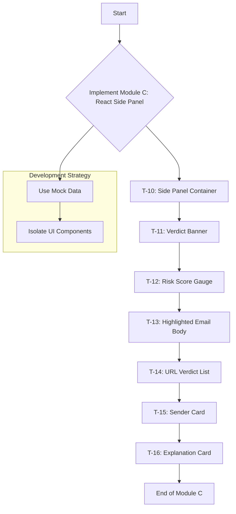

# Development Plan: React Side Panel (Module C)

This document outlines the plan for implementing the React Side Panel components for the Email Security Chrome Extension.

## Implementation Strategy

The development will focus on **Module C: React Side Panel**, which includes all tasks assigned to Krishna Chaitanya. All components will be built using mock data to ensure they can be developed and tested independently of the backend and core extension logic.

## Development Flow

## Next Steps

Once this plan is approved, the process will move to **Act Mode** to begin implementing the following tickets in sequence:
1.  **T-10:** Side Panel Container
2.  **T-11:** Verdict Banner
3.  **T-12:** Risk Score Gauge
4.  **T-13:** Highlighted Email Body
5.  **T-14:** URL Verdict List
6.  **T-15:** Sender Card
7.  **T-16:** Explanation Card